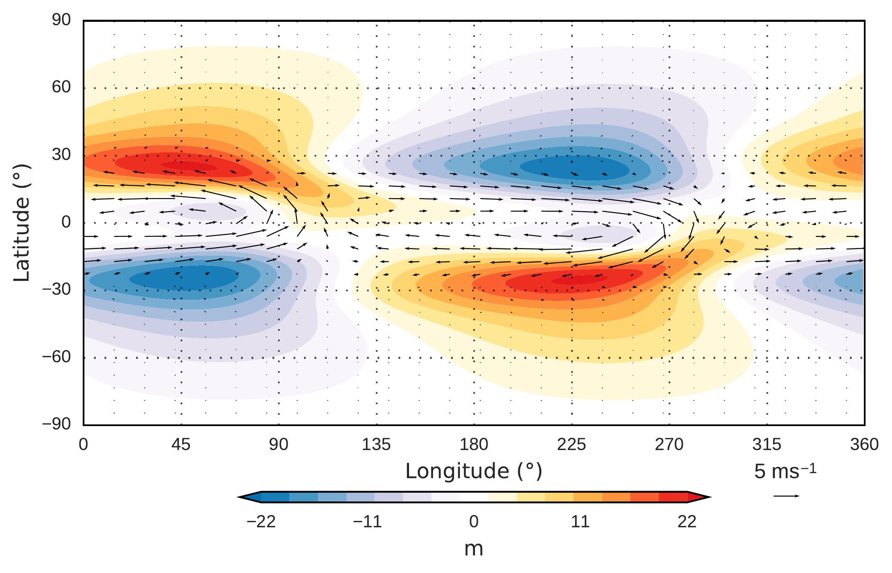
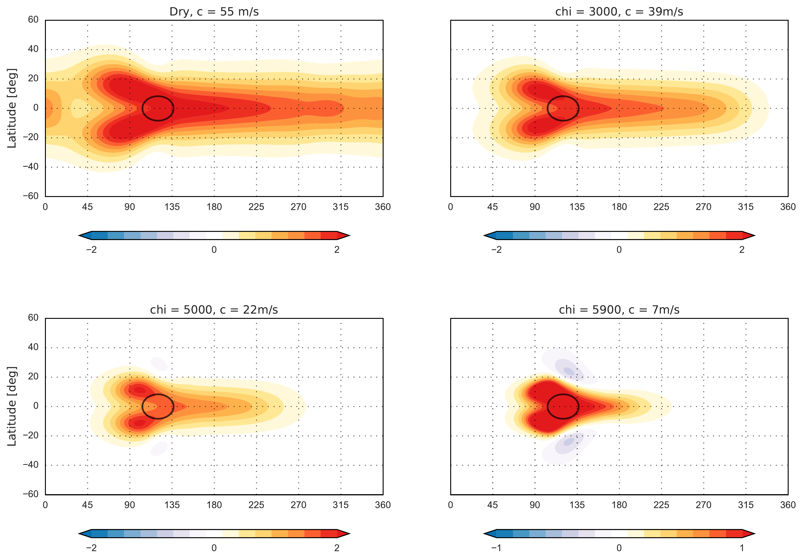
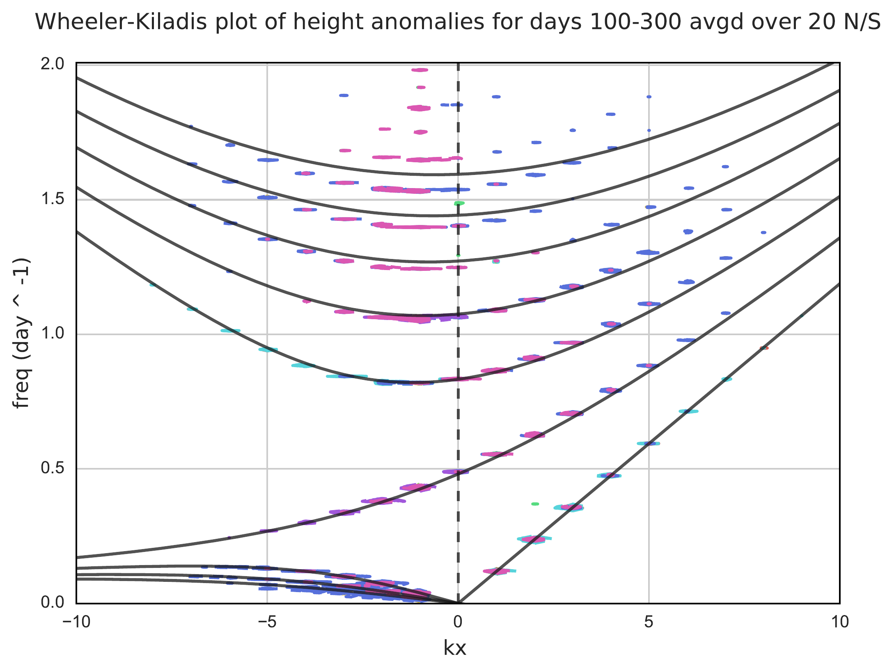
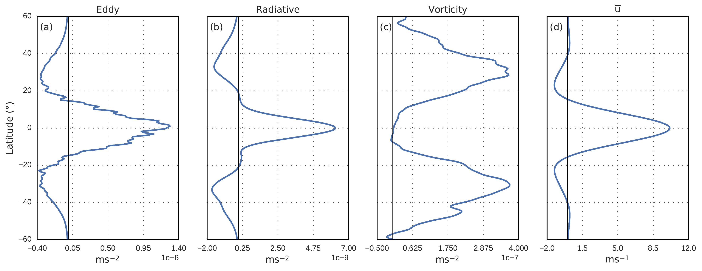
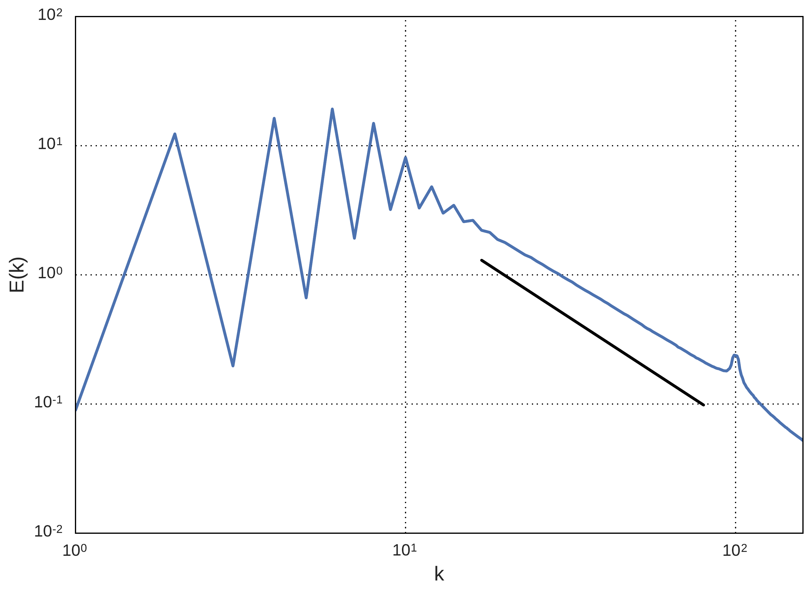

# pySWE
A python based framework for solving the spherical shallow water equations (SWE).
Example scripts for solving more linear Matsuno-Gill like problem as well as a non-linear turbulent case are included.
Moist shallow water code is included now.

Plot utilities include some commonly used functions used for analysing the data. 
It includes Wheeler-Kiladis plot, wave filtering, energy spectral anlaysis and so on.

Some of the results which can be generated by pySWE.

Steady state height and velocity fields for the Matsuno (vorticity) forcing case.

Reduction in wavespeed in the presence of moisture.

Wheeler-Kiladis plot showing the power spectra of various tropical waves.

Momentum fluxes showing the emergence of super-rotating state.

Kinetic energy spectra showing an inverse cascade with a scaling of -5/3.

## Requirements :
You need to install shtns (https://users.isterre.fr/nschaeff/SHTns/) and fftw (http://www.fftw.org/) library.
Installation guide can be found here https://users.isterre.fr/nschaeff/SHTns/compil.html
